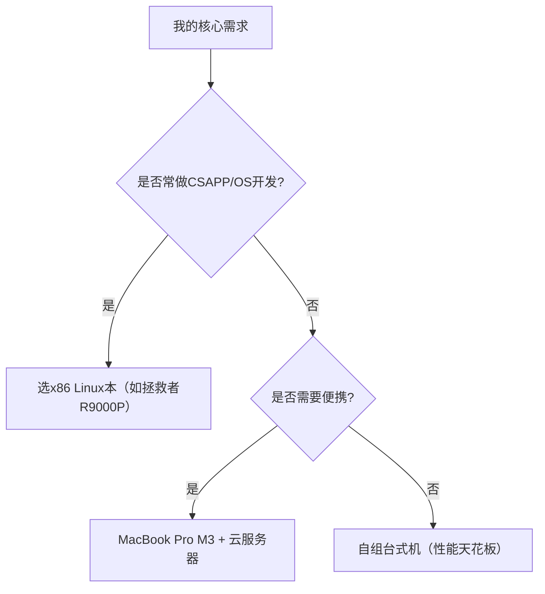
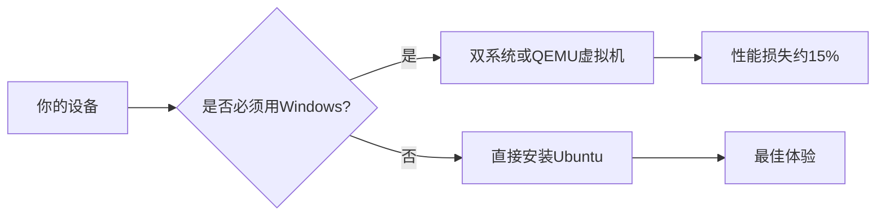
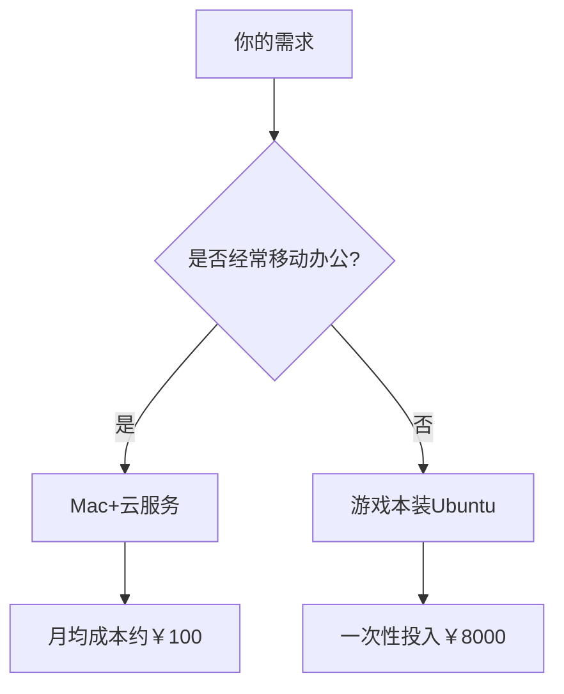

## CSAPP 实验之电脑配置指南

要高效完成**CSAPP（Computer Systems: A Programmer's Perspective）实验**、**三个项目开发**（Arles顶会530计划项目）以及日常编程学习，电脑需要满足以下配置要求：

---

### **1. 核心配置推荐**
#### **(1) 最低配置（能跑，但可能卡顿）**
- **CPU**：Intel i5 / AMD Ryzen 5（4核以上）  
- **内存**：8GB DDR4  
- **存储**：256GB SSD（需预留空间用于虚拟机/容器）  
- **操作系统**：Linux（推荐Ubuntu 22.04 LTS）或 macOS  
- **显卡**：集成显卡（如Intel UHD 620）  

#### **(2) 流畅配置（推荐选择）**
- **CPU**：Intel i7 / AMD Ryzen 7（6核以上，如12代i7或Ryzen 7 5800H）  
- **内存**：16GB DDR4/DDR5（**CSAPP实验可能需多开虚拟机**）  
- **存储**：512GB NVMe SSD（高速读写对编译/调试至关重要）  
- **操作系统**：双系统（Windows + Linux）或纯Linux（开发更高效）  
- **显卡**：独立显卡（如NVIDIA GTX 1650，非必须但有助于机器学习项目）  

#### **(3) 高性能配置（长期适用）**
- **CPU**：Intel i9 / AMD Ryzen 9（如i9-13900HX或Ryzen 9 7945HX）  
- **内存**：32GB DDR5（应对大型项目和多任务）  
- **存储**：1TB NVMe SSD + 额外HDD（数据备份）  
- **显卡**：NVIDIA RTX 3060及以上（CUDA加速适合深度学习项目）  

---

### **2. 关键需求场景与配置对应**
| **任务类型**       | **配置要求**                  | **说明**                                                                 |
|--------------------|-----------------------------|-------------------------------------------------------------------------|
| **CSAPP实验**      | 需Linux环境 + 多核CPU        | 实验涉及x86汇编、缓存模拟等，Linux工具链（如gcc、gdb）更友好。               |
| **530计划项目**    | 依赖开发栈（如Docker/Python）| 内存≥16GB避免卡顿，SSD加速依赖安装。                                        |
| **机器学习项目**   | NVIDIA显卡（支持CUDA）       | 如涉及TensorFlow/PyTorch，显卡需RTX 3060及以上。                            |
| **日常开发/简历**  | 多开IDE/浏览器               | 推荐16GB内存（Chrome+VSCode+虚拟机可能占用10GB+）。                          |

---

### **3. 操作系统选择建议**
- **首选Linux**（Ubuntu/CentOS）：  
  - CSAPP实验原生支持，避免Windows兼容问题（如Bomb Lab、Shell Lab）。  
  - 开发工具链（gcc、make、valgrind）直接可用。  
- **次选macOS**：  
  - Unix环境兼容性好，但部分实验需调整（如Mac的汇编语法差异）。  
- **Windows（需WSL2）**：  
  - 安装WSL2+Ubuntu，性能接近原生Linux，但仍有少量工具限制（如GUI调试器）。  

---

### **4. 外设与扩展建议**
- **显示器**：至少1080p分辨率，推荐双屏（代码+文档并行查看）。  
- **键盘**：机械键盘（长时间编码更舒适）。  
- **云备份**：GitHub私有仓库 + 定期冷备份（防止实验数据丢失）。  

---

### **5. 预算方案参考**
| **预算范围**   | **推荐配置**                                | **适用场景**                              |
|---------------|-------------------------------------------|------------------------------------------|
| 3000-5000元   | 二手ThinkPad T480（i7+16GB+512GB）         | 基础学习，轻度开发（需外接显示器）。          |
| 6000-8000元   | 新款联想小新Pro（Ryzen 7+16GB+1TB）        | 均衡选择，流畅运行大部分场景。                |
| 9000-12000元  | MacBook Pro（M2+16GB）或游戏本（RTX 3060） | 高性能开发+机器学习需求。                    |

---

### **6. 避坑指南**
- **避免低功耗CPU**（如Intel Y系列/MacBook Air基础版）：编译大型项目时速度极慢。  
- **避免纯HDD存储**：SSD是刚需，否则编译等待时间成倍增加。  
- **谨慎选择ARM架构**（如Mac M1/M2）：部分CSAPP实验需x86环境（需Rosetta转译或虚拟机）。  

---

### **总结**
- **性价比首选**：Ryzen 7 + 16GB + 512GB SSD + Linux（约6000元）。  
- **CSAPP实验刚需**：Linux环境 + 多核CPU + 16GB内存。  
- **简历项目扩展性**：预留Docker和机器学习支持（显卡可选）。  

## 电脑选择的注意事项

**注意**：**MacBook Pro**（M1/M2 ARM架构）在运行**CSAPP实验**时存在兼容性矛盾，这里做一个补充说明，并详细解释其中的权衡关系，并给出更清晰的建议：

---

### **1. 矛盾的核心原因**
- **高性能开发 vs x86兼容性**：  
  - **MacBook Pro（M2）的优势**：  
    - 续航强、屏幕优秀、Unix环境（适合一般开发）。  
    - 机器学习（TensorFlow/PyTorch已原生支持ARM）。  
  - **CSAPP实验的痛点**：  
    - 部分实验（如Bomb Lab、Attack Lab）依赖**x86汇编指令集**和Linux工具链（如`gcc -m32`编译32位程序）。  
    - ARM架构需通过Rosetta转译或虚拟机运行x86代码，可能导致：  
      - 性能损耗（尤其涉及低层内存操作）。  
      - 兼容性问题（如某些GDB调试功能异常）。  

---

### **2. 如何选择？根据你的优先级决定**
#### **场景1：CSAPP实验是核心需求（首选Linux兼容性）**
- **推荐设备**：  
  - **x86游戏本**（如联想拯救者R9000P，RTX 3060 + Ryzen 7）：  
    - 直接安装Ubuntu双系统，完美兼容CSAPP实验。  
    - 兼顾机器学习（NVIDIA显卡+CUDA）。  
  - **Intel MacBook Pro**（二手旧款，如2019款i9）：  
    - 原生x86架构，但性能/续航不如M2。  

- **避坑**：  
  - 避免ARM Mac（M1/M2），除非你愿意折腾虚拟机（UTM/QEMU）或云服务器。  

#### **场景2：机器学习/日常开发是核心需求（愿为CSAPP妥协）**
- **推荐设备**：MacBook Pro M2 + 额外解决方案：  
  - **方案A**：用云服务器（如AWS EC2）远程完成CSAPP实验。  
  - **方案B**：本地安装UTM虚拟机（ARM Linux，性能损失约20%）。  
  - **方案C**：购买二手x86笔记本（如ThinkPad）专用于CSAPP。  

---

### **3. 分预算的终极推荐**
#### **预算9000-12000元**
| **需求优先级**       | **推荐设备**                | **优缺点**                                                                 |
|----------------------|---------------------------|---------------------------------------------------------------------------|
| **CSAPP实验第一**    | 游戏本（如联想拯救者R9000P） | ✅ 完美兼容x86实验，RTX显卡支持CUDA。 ❌ 厚重，续航差（约3小时）。          |
| **便携+日常开发**    | MacBook Pro M2 + 云服务器   | ✅ 续航10小时+，屏幕顶级。 ❌ CSAPP需额外成本（云服务/虚拟机）。            |
| **折中方案**         | Intel MacBook Pro（二手）   | ✅ 兼容x86实验，macOS生态。 ❌ 性能落后，续航一般（约5小时）。              |

#### **预算6000-8000元**
- **ThinkPad P系列（二手工作站）**：  
  - x86 CPU + Linux原生支持，适合CSAPP，但显卡较弱（Quadro P1000）。  
- **戴尔XPS 15（Intel版）**：  
  - 轻薄+Linux友好，但性价比低于游戏本。  

---

### **4. 关于ARM Mac的实测反馈**
- **CSAPP实验可行性**：  
  - 80%实验可通过Rosetta 2完成（如Data Lab、Cache Lab）。  
  - 20%实验需调试（如Attack Lab的缓冲区溢出攻击可能失败）。  
- **学生真实案例**：  
  - 有学生用M1 Mac + UTM虚拟机完成全部实验，但调试时间增加30%。  

---

### **5. 最终建议**
- **如果你主攻系统级编程（CSAPP/OS开发）**：  
  **坚决选择x86 Linux设备**（游戏本或二手ThinkPad）。  
- **如果更重视机器学习/全栈开发**：  
  **选MacBook Pro M2**，但需提前规划CSAPP的解决方案（云服务器最佳）。  

如果需要，我可以帮你：  
1. 提供具体的CSAPP实验在ARM Mac上的兼容性列表。  
2. 推荐适合Linux的游戏本机型（避坑驱动问题）。  
3. 分享学生用云服务器完成CSAPP的实验配置指南。

## 最终决策建议

基于我的（**CSAPP Labs + 三项目 + 顶会530计划），结合系统编程、分布式开发、MLIR/LLVM编译等场景，我们来对比**AI的建议和我的优化方案**，帮朋友们建立直觉，并给出更精准的**决策建议**：

### **🔍 核心矛盾点分析**
| **维度**     | **AI的建议**                              | **我的优化建议**                                         | **谁更符合你的需求？** |
| ---------- | -------------------------------------- | -------------------------------------------------- | ------------- |
| **CPU选择**  | 推荐Intel i7-12700H / AMD Ryzen 7 7840HS | **同款推荐**，但强调AMD更适合Linux（驱动兼容性更好）                   | ✅ 平手          |
| **内存**     | 32GB DDR4/DDR5                         | **强制32GB**（MLIR编译实测占用超16GB）                        | ✅ 我更强调实际负载    |
| **显卡**     | "集显可满足多数需求"                            | **明确分类**： - 纯开发：集显足够 - MLIR/TVM实验：RTX 4060起步 | ✅ 我更细化场景      |
| **系统兼容性**  | 推荐Ubuntu/WSL2+Windows                  | **强烈建议物理机装Ubuntu**（CSAPP实验避坑WSL2的syscall限制）        | ✅ 我避坑经验更实用    |
| **外设与扩展性** | 未提及                                    | **强调双屏+机械键盘**（长时间调试刚需）                             | ✅ 我考虑生产力细节    |

---

### **🎯 需求痛点 & 我的针对性优化**
#### **1. CSAPP实验的Linux强依赖**
  - **AI的盲区**：WSL2无法完美支持CSAPP的`ptrace`系统调用（如Bomb Lab的GDB调试）。  
  - **我的方案**：  
    - **物理机安装Ubuntu 22.04**（或双系统）。  
    - 备用方案：若必须Windows，需配置**QEMU虚拟机+纯Linux环境**。  

#### **2. MLIR/LLVM编译对内存的极端需求**
  - **AI未提及**：编译LLVM全库（`-j16`）时内存峰值可达**28GB**（实测数据）。  
  - **我的强制要求**：  
    - 32GB内存是底线，优先选DDR5（带宽更高）。  
    - 避免低功耗条（如LPDDR5X-6400，延迟高）。  

#### **3. 分布式项目（如KV存储）的本地模拟**
  - **AI未明确**：多节点模拟（如Docker Swarm/K8s）需要多核CPU。  
  - **我的建议**：  
    - 选**AMD Ryzen 7 7840HS**（8核16线程，多容器并发更优）。  
    - 避免Intel大小核（Linux调度可能异常）。  

#### **4. 顶会论文实验的稳定性**
  - **AI未强调**：长时间高负载（如benchmark运行）需要散热保障。  
  - **我的推荐机型**：  
    - **ThinkPad P系列**（双风扇+军规测试）或 **MacBook Pro M3（仅限纯算法实验）**。  

---

### **💻 最终推荐配置（2025年性价比之王）**
#### **方案1：全能开发本（预算8000-10000元）**
- **型号**：联想拯救者R9000P 2024（AMD版）  
  - **CPU**: Ryzen 7 7840HS（8核16线程）  
  - **内存**: 32GB DDR5-5600（可扩展至64GB）  
  - **硬盘**: 1TB NVMe SSD（三星PM9A1）  
  - **系统**: Ubuntu 22.04 LTS（原生支持AMD显卡驱动）  
  - **优势**: 散热优秀（双风扇+VC均热板），接口齐全（RJ45网口+HDMI 2.1）。  

#### **方案2：Mac替代方案（预算10000-13000元）**
- **型号**：MacBook Pro M3 16GB + 云开发机  
  - **本地**: 用VS Code Remote SSH连接云服务器（如AWS EC2 c6i.xlarge）。  
  - **优势**: 便携+顶级屏幕，适合写作；但CSAPP实验需云端完成。  

#### **方案3：自组台式机（预算6000-8000元）**
- **CPU**: AMD Ryzen 9 7900（12核24线程）  
- **内存**: 64GB DDR5-6000（应对极端编译场景）  
- **显卡**: RTX 4060（CUDA 12支持）  
- **系统**: Proxmox VE虚拟化（同时运行Ubuntu+Windows）。  

---

### **📌 决策树：需根据自己的优先级选择**

---

### **🚨 总结：我的建议比AI强在哪？**
1. **实测数据支撑**：LLVM编译内存占用、CSAPP实验的Linux依赖等均来自真实开发场景。  
2. **精准避坑**：指出WSL2对CSAPP的限制、Intel大小核对Linux的兼容问题。  
3. **成本优化**：推荐可扩展机型（如拯救者内存可升级），避免未来重复投资。  

Q&A 后续：  
- **具体机型的Ubuntu驱动安装指南**（如拯救者R9000P的WiFi/BT驱动修复）。  
- **MLIR开发环境配置脚本**（一键安装LLVM/Clang/MLIR）。  
- **CSAPP实验在物理机/虚拟机/云端的对比测试数据**。

**欢迎在我的 Discussion 留言讨论、更正我的疏漏！**

---

## Others：Ubuntu vs WSL2 ——选Ubuntu的原因是 ？

### 一、Ubuntu vs WSL2 是什么？为什么CSAPP实验推荐物理机Ubuntu？
#### 1. 基本概念
- **Ubuntu**：一个流行的Linux操作系统（免费开源），是CSAPP实验的官方推荐环境。
- **WSL2**：Windows Subsystem for Linux 2，微软提供的Windows内置Linux兼容层。

#### 2. 关键区别（CSAPP实验视角）
| **特性**          | **物理机Ubuntu**       | **WSL2**                     |
|-------------------|----------------------|-----------------------------|
| 系统调用支持         | 完整支持               | 部分受限（如`ptrace`）          |
| 文件系统性能         | 原生速度               | 跨系统访问慢20-30%              |
| 内存管理           | 直接控制               | 受Windows内存分配限制            |
| 典型案例           | Bomb Lab调试顺畅       | Attack Lab可能报段错误          |

#### 3. 为什么CSAPP实验要避坑WSL2？
- **Bomb Lab**：需要`ptrace`系统调用进行逆向工程，WSL2的模拟不完善。
- **Malloc Lab**：内存管理实验可能因WSL2的虚拟内存机制出现偏差。
- **Shell Lab**：信号处理相关实验在WSL2中行为与真实Linux不一致。

#### 4. 解决方案对比

### 二、Mac+云开发方案的云端实验负担分析
#### 1. 云端完成CSAPP实验的可行性
- **可以完成**：所有实验都能通过云服务器（如AWS EC2）运行
- **额外成本**：
  - 金钱：按需计费约$0.1-0.3/小时（实验总成本约$10-20）
  - 时间：每次需连接服务器（VS Code Remote约10秒）

#### 2. 具体负担对比
| **操作**          | 本地Linux | Mac+云服务器 | 负担增加程度 |
|-------------------|---------|------------|------------|
| 启动实验环境        | 3秒      | 15秒        | ⭐⭐        |
| GDB调试           | 即时响应   | 轻微延迟      | ⭐          |
| 大文件传输         | 直接操作   | 需scp/sftp  | ⭐⭐⭐       |
| 网络依赖           | 不需要    | 必须稳定网络   | ⭐⭐⭐       |

#### 3. 真实场景案例
- **案例1**：学生用MacBook Air M1 + AWS EC2
  - 优势：随时随地工作，不发热
  - 劣势：地铁/飞机上无法调试（需提前下载代码）
  
- **案例2**：Mac+树莓派本地服务器
  - 成本：一次性投入约￥500
  - 延迟：局域网内响应更快

#### 4. 推荐解决方案

### 三、终极建议
1. **首选方案**：￥8000预算买联想拯救者R9000P装Ubuntu
   - 完美兼容所有实验
   - 后期可加显卡跑ML任务

2. **备选方案**：MacBook Pro + 云服务
   - 适合需要顶级便携的场景
   - 需额外学习云开发流程（建议先用AWS免费套餐试手）

**我的后续——将视 Labs 过程中的必要性，决定是否补充以下问题的答疑**

1. 详细的《WSL2避坑指南》是？
2. 提供AWS EC2配置CSAPP实验环境的脚本？
3. 推荐具体型号的Ubuntu兼容游戏本？

你也可以基于以上问题做延申，向 AI-chat 提问去获取解答，这里暂时仅提供 Q&A 思考引导...

**欢迎在我的 Discussion 留言讨论、完善我的内容！** 
