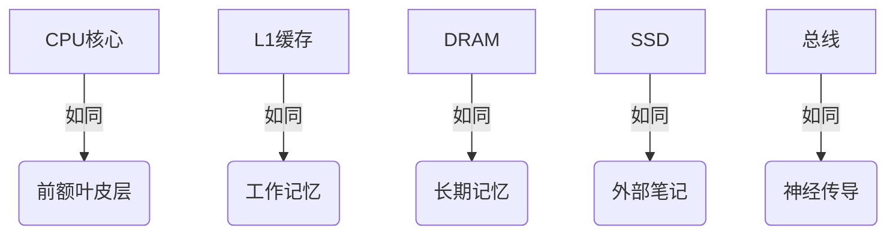
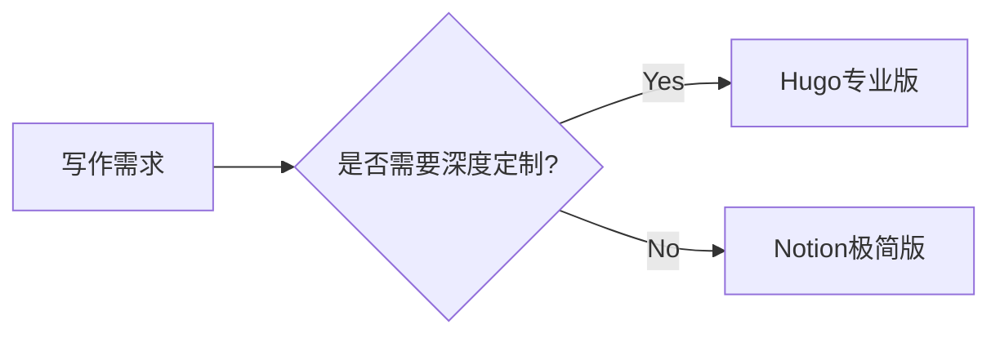

# 2025-07-28 技术探索全记录：从底层原理到博客实践

> - 本文是笔者 Arles 今日探索计算机内存本质及如何搭建技术博客的Q&A精华整理           
> - 博客搭建核心思路：用 Hugo 在本地写好网站（内容+主题），通过 Git 推送到 GitHub 仓库，自动触发 GitHub Pages 生成公开可访问的静态网站。

## 核心议题全景图

1. **计算机体系结构深度认知**
   - 缓存管理的硬件本质
   - 寄存器与缓存的哲学差异
   - 类人化系统认知模型构建

2. **Hugo博客实战全记录**
   - PaperMod主题安装调试
   - 模板文件路径之谜
   - 零代码替代方案探索

## 一、计算机体系结构本质追问

### Q1：为什么缓存必须由硬件管理？

**💡 本质回答**  
缓存是"时空局部性"的物理实现载体，需要：
- 纳秒级实时响应（软件无法胜任）
- 动态预测程序行为（基于硬件访问模式嗅探）
- 透明一致性维护（多核场景下的数据同步）

**与寄存器管理对比**  
| 维度        | 寄存器               | 缓存                  |
|-----------|--------------------|---------------------|
| 管理主体     | 编译器显式分配           | 硬件自动管理             |
| 决策时间     | 编译时（秒级）          | 运行时（纳秒级）          |
| 优化目标     | 指令效率最大化           | 访问命中率最大化           |
| 可见性      | 架构可见/可编程         | 完全透明               |

### Q2：如何建立直觉化的系统认知？

**🧠脑科学映射模型**  


**🌐 系统认知升级路径**  
1. 先理解"存储金字塔"的时空权衡
2. 掌握硬件自动化的设计哲学
3. 建立跨层优化思维

## 二、Hugo博客建设全纪实

### Q3：PaperMod主题安装异常处理

**🚨 故障现象链**  
1. `rm -r` 权限不足 → 需管理员PS
2. Git子模块残留 → 需清理缓存
3. 模板路径错误 → 定位到`_default/`

**✅ 终极解决方案**  
```powershell
# 强制清除旧主题
Remove-Item -Recurse -Force themes/PaperMod

# 重建Git记录
git rm --cached themes/PaperMod
git commit -m "reset theme"

# 正确安装流程
git submodule add https://github.com/adityatelange/hugo-PaperMod.git themes/PaperMod
```

### Q4：零代码博客替代方案

**📊 方案对比矩阵**  
| 方案                | 技术门槛 | 可定制性 | 维护成本 |
|-------------------|-------|-------|------|
| Hugo+GitHub       | 中高    | ★★★★  | 中    |
| Notion+Deploy     | 零     | ★★    | 低    |
| WordPress.com     | 低     | ★★★   | 中    |
| Obsidian+Publish  | 低     | ★★    | 低    |

**✨ 推荐路径**  


## 💭 延伸思考议题

1. **缓存一致性协议**：MESI协议如何类比人类团队协作中的信息同步机制？
2. **编译器辅助缓存优化**：哪些代码模式会"欺骗"硬件预取器的预测逻辑？
3. **无代码方案的边界**：当Notion遇到数学公式渲染时，如何平衡便捷性与专业性？
```
🎗️欢迎在我的GitHub discusion留言讨论！
-- 留言可 @ 笔者共享【从零开始完整部署 Hugo 博客到 GitHub Pages 全流程教程（推荐 PaperMod 主题）】指南一份...
