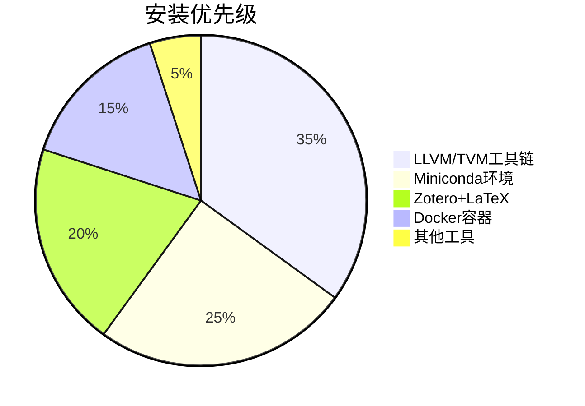

## DAY1 Ubuntu/Linux 学习笔记：从 Win11 转向 Ubuntu 的开始指南                                                             
—— CSAPP & 顶会计划的系统性起点

### 背景：

> 1.**我发现 Ubuntu 系统与 Win11 有很大的区别。为完成 CSAPP Labs 实验、快速上手 Ubuntu 系统，总结了该入门指南。**
> 
> 2.**环境配置的流畅度**（尤其是**语言/网络一致性和工具链同步**）是高效工作的隐形基石。

---

### 🧭 一、Ubuntu 与 Linux 的关系

| 名称     | 类型               | 关系                                        |
| ------ | ---------------- | ----------------------------------------- |
| Linux  | 内核               | Ubuntu 的基础                                |
| Ubuntu | 操作系统（发行版）        | 基于 Linux 内核，附带 GUI、包管理、工具链等               |
| 类比     | Android vs Linux | Android 是移动端定制的 Linux，Ubuntu 是桌面/服务器端的定制版 |

---

### 🌍 二、当前主流操作系统对比

| 操作系统               | 应用领域      | 核心特性       | 背后设计哲学      |
| ------------------ | --------- | ---------- | ----------- |
| Windows 11         | 桌面端       | GUI 友好，生态广 | 用户至上，封闭兼容   |
| macOS              | 创意/办公     | 美学、统一性强    | 高度集成硬件与系统   |
| Ubuntu / Linux 发行版 | 编程/科研/服务器 | 开源，自由度高    | 一切皆文件，简洁、稳定 |

---

### 🔄 三、命令行对比（PowerShell vs Bash）

| 对比维度 | PowerShell（Win） | Bash（Ubuntu/Linux） |
| ---- | --------------- | ------------------ |
| 基础语言 | .NET、对象导向       | Shell script，文本流   |
| 生态   | 更接近 GUI 逻辑      | 完全 CLI 导向          |
| 数据处理 | 操作对象            | 操作文本流（更适合组合）       |
| 典型用途 | 管理系统组件          | 自动化脚本、组合命令         |

---

### 📚 四、学习资源推荐（多媒体融合）

| 类型 | 推荐资源                                                                                   | 说明           |
| -- | -------------------------------------------------------------------------------------- | ------------ |
| 文档 | [Ubuntu官方文档](https://ubuntu.com/tutorials)、[TLCL](https://linuxcommand.org/tlcl.php)   | 入门权威、循序渐进    |
| 视频 | YouTube: DistroTube / Brodie Robertson / The Linux Experiment                          | 实操演示丰富，适合跟练  |
| 图文 | [Explainshell](https://explainshell.com/)、[Linuxjourney.com](https://linuxjourney.com) | 可视化命令分解+路径引导 |

---

### 🔢 五、命令使用频率分布表（基于 80/20 法则）

| 使用频率        | 命令集合                                                                                                        | 备注             |
| ----------- | ----------------------------------------------------------------------------------------------------------- | -------------- |
| 高频命令（80%任务） | `ls`, `cd`, `pwd`, `cp`, `mv`, `rm`, `mkdir`, `touch`, `cat`, `grep`, `find`, `chmod`, `sudo`, `apt`, `man` | 一定要熟练          |
| 中频命令        | `tar`, `curl`, `wget`, `top`, `kill`, `df`, `du`, `history`, `nano`, `vim`, `ssh`, `scp`                    | 常出现在调试与部署      |
| 低频命令        | `chown`, `lsof`, `xargs`, `sed`, `awk`, `tee`, `cron`, `alias`                                              | 日常用不到，但必须知道在哪查 |

---

### 🔁 六、理解高手特性：组合式编程思维（以管道和重定向为例）

> ✅ 高手不是会很多命令，而是擅长用“组合管道”处理任务：
> 如：

```bash
cat access.log | grep "404" | sort | uniq -c | sort -nr
```

解释：读取日志 → 筛选 404 → 排序 → 去重计数 → 再排序

---

### 💼 七、模拟实际场景的命令指南（按任务分类）

| 场景      | 命令案例                                          | 说明            |
| ------- | --------------------------------------------- | ------------- |
| 📁 文件管理 | `cp`, `mv`, `rm`, `find`, `du -h`             | 日常最常见         |
| ⚙️ 系统监控 | `top`, `htop`, `free -m`, `df -h`             | 性能调优          |
| 🔐 权限管理 | `chmod`, `chown`, `sudo`, `groups`            | 用户/安全         |
| 🔌 软件安装 | `apt update && apt install`                   | Ubuntu 包管理核心  |
| 🧪 脚本开发 | `bash script.sh` / `chmod +x`                 | CSAPP 项目中的自动化 |
| 🌐 网络调试 | `ping`, `curl`, `netstat`, `ss`, `traceroute` | 网络实验辅助        |

---

### 🌀 八、Shell / Bash / PowerShell 关系梳理

| 名称         | 平台             | 本质          | 与 Shell 的关系                  |
| ---------- | -------------- | ----------- | ---------------------------- |
| Shell      | 通用名词           | 用户与内核交互桥梁   | Bash、Zsh、PowerShell 都是 Shell |
| Bash       | Linux 默认 Shell | 轻量级解释器      | 多用于 CLI + 脚本                 |
| PowerShell | Windows Shell  | 面向对象，.NET集成 | 本质上是不同体系下的 Shell             |

---

### 📦 九、你应重点学习的模块体系（建议路径）

| 模块                   | 推荐内容                                      |
| -------------------- | ----------------------------------------- |
| Ubuntu 入门            | 文件系统结构 / bash 常用命令 / 软件安装                 |
| Shell 编程             | 变量、流程控制、函数、重定向、脚本开发                       |
| 工具生态                 | Vim / Git / apt / curl / grep / sed / awk |
| 系统管理                 | 权限 / 用户 / 网络 / 日志分析 / 磁盘管理                |
| 项目实战                 | 结合 CSAPP Labs + 顶会计划分阶段使用                 |
| Nginx / 编译器 / Docker | 为中期研究方向做准备（AI编译、部署）                       |

---

## 🔚 总结：

> ✅ **Ubuntu 是迈入系统与编译世界的必经之路。虽然前期习惯转换痛苦，但其自由度、组合式思想、开源生态将是你科研/项目成长的倍增器。**

---

## 🔍 拓展问题（欢迎讨论）：

1. 在WSL2环境下做CSAPP实验是否会影响对Linux底层机制（如系统调用、文件权限）的理解？应该如何规避潜在认知偏差？

2. 当Shell脚本复杂度达到什么阈值时，应该考虑迁移到Python/Perl等高级语言？有哪些具体的衡量指标？

3. 在MLIR/LLVM等编译器开发场景中，传统Unix文本流处理方式面对IR等结构化数据时是否显露出局限性？现代工具链（如jq/yq）如何弥补这些不足？

---

## **DAY2 Ubuntu终极必备工具表（科研+开发极简版）**

以下是根据你的AI编译器/嵌入式/分布式研究方向，结合高效开发与学术需求，优化后的 **终极推荐表格** ，已过滤冗余工具并强化关键组件：

| **类别**         | **核心工具**               | **安装命令**                                                                 | **不可替代性说明**                      |
|------------------|--------------------------|----------------------------------------------------------------------------|---------------------------------------|
| **编译器基石**    | LLVM/MLIR/Clang         | `sudo apt install llvm-16 mlir-16-dev clang-16 lldb-16`                    | 所有编译器研究的底层基础                   |
| **AI编译器**      | TVM (源码编译)           | `git clone --recursive https://github.com/apache/tvm && cd tvm && mkdir build && cmake ..` | 支持多后端部署优化                       |
| **构建系统**      | CMake + Ninja           | `sudo apt install cmake ninja-build`                                       | 高效构建C++项目                        |
| **性能剖析**      | Perf + Hotspot          | `sudo apt install linux-tools-$(uname -r) hotspot`                         | 火焰图生成/硬件计数器分析                 |
| **Python环境**    | Miniconda + Mamba       | `wget https://repo.anaconda.com/miniconda/Miniconda3-latest-Linux-x86_64.sh` | 隔离环境，比pip快10倍的依赖管理           |
| **论文写作**      | Zotero + LaTeX          | `sudo snap install zotero`<br>`sudo apt install texlive-full`              | 文献管理+期刊级排版                      |
| **开发IDE**       | VSCode + MLIR插件        | `sudo snap install code --classic`                                         | 官方MLIR语法高亮+远程开发                |
| **终端效率**      | Zsh + OhMyZsh           | `sudo apt install zsh && sh -c "$(curl -fsSL https://raw.githubusercontent.com/ohmyzsh/ohmyzsh/master/tools/install.sh)"` | 自动补全/Git状态显示                    |
| **版本控制**      | Git + GitLens           | `sudo apt install git`                                                     | 代码版本管理+VSCode增强                 |
| **容器化**        | Docker + NVIDIA容器工具包 | `sudo apt install docker.io nvidia-container-toolkit`                      | 实验环境隔离+GPU穿透                    |
| **知识管理**      | Obsidian                | [下载AppImage](https://obsidian.md)                                        | 双向链接笔记，适合技术文档沉淀             |

**✅ 1. 补充实用但不喧宾夺主的“小工具”** 

虽然你的目标是极简科研环境，但建议加上几个“低成本提升体验”的小工具：

|工具|安装命令|用途|
|---|---|---|
|`flameshot`|`sudo apt install flameshot`|自定义截图，写文档 / 提问 / 反馈都更高效|
|`gnome-tweaks`|`sudo apt install gnome-tweaks`|改快捷键、字体、主题、触控板等|
|`nautilus-admin`|`sudo apt install nautilus-admin`|在文件管理器中右键“以管理员打开”|
|`net-tools`|`sudo apt install net-tools`|启用 ifconfig/netstat 等传统命令|


---

### **关键优化说明**
1. **LLVM版本选择**  
   ```bash
   # 添加官方源获取最新版
   wget https://apt.llvm.org/llvm.sh && chmod +x llvm.sh && sudo ./llvm.sh 16
   ```

2. **TVM编译加速**  
   ```bash
   # 启用CUDA/LLVM支持
   echo 'set(USE_CUDA ON)' >> build/config.cmake
   echo 'set(USE_LLVM ON)' >> build/config.cmake
   ```

3. **科研增强配置**  
   ```bash
   # Jupyter Lab优化
   pip install jupyterlab jupyter_contrib_nbextensions
   ```

---

### **对比优势**
| **维度**       | **本方案**                | **其他方案典型问题**               |
|---------------|--------------------------|----------------------------------|
| 编译器支持       | 官方LLVM源+MLIR开发头文件    | 系统仓库版本陈旧                    |
| Python管理     | Mamba解决conda慢的问题      | 纯pip易导致依赖冲突                 |
| 性能分析        | Hotspot可视化Perf数据       | 仅命令行工具不够直观                |
| 可复现性        | Docker + 精确版本conda环境  | 全局安装易污染系统                  |
| 知识沉淀        | Obsidian双向链接           | 普通Markdown工具难以建立知识网络     |

---

### **执行优先级**


建议立即执行的核心命令：
```bash
# 1. 基础底座
wget https://apt.llvm.org/llvm.sh && sudo ./llvm.sh 16
wget https://repo.anaconda.com/miniconda/Miniconda3-latest-Linux-x86_64.sh

# 2. 开发环境
sudo apt install cmake ninja-build git docker.io
sudo snap install code --classic
```


🌍Welcome follow my GitHub:https://github.com/ArlesZhang/
